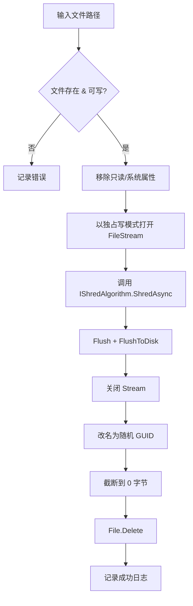

# 粉碎一切 — Windows 文件粉碎工具 设计文档

> 版本：v0.1 草案 · 日期：2026-05-22（技术栈于 2026-05-23 升级到 .NET 10） · 技术栈：C# / .NET 10 / WPF (MVVM)

---

## 1. 项目概述

### 1.1 产品定位
一款运行于 Windows 桌面的安全文件粉碎工具，通过多次覆写算法彻底销毁文件内容，使其无法通过常规取证手段恢复。面向对数据销毁有合规或隐私需求的个人和小团队用户。

### 1.2 核心价值
- **彻底销毁**：实现工业级覆写算法（DoD 5220.22-M）。
- **易用**：拖拽 + 右键菜单 + 回收站集成，零学习成本。
- **可信**：每一步均可日志审计，开源算法实现，无后台联网。

### 1.3 设计原则
1. **安全第一**：操作不可逆，必须有清晰的二次确认。
2. **可观察**：进度、字节数、剩余时间、错误均可视化。
3. **可扩展**：算法、UI、集成层解耦，便于增删。
4. **最小权限**：仅在需要时请求管理员权限（空闲空间擦除、系统目录）。

---

## 2. 功能范围

| 模块 | 优先级 | 说明 |
|---|---|---|
| 文件/文件夹粉碎 | P0 | 拖拽或对话框选取，递归处理目录 |
| 多算法选择 | P0 | DoD 3/7 次、单次随机、零填充+改名 |
| 右键菜单集成 | P1 | 资源管理器右键 → 「粉碎一切」 |
| 回收站集成 | P1 | 一键彻底清空回收站 |
| 空闲空间擦除 | P2 | 通过填充剩余空间覆写已删除痕迹 |
| 操作日志 | P1 | 本地 JSON 日志，含哈希校验 |
| 任务暂停/取消 | P1 | 长任务可中断 |

非目标（当前版本不做）：网络硬盘销毁、SSD TRIM、跨平台、企业策略下发。

---

## 3. 技术架构

### 3.1 总体分层

```
┌─────────────────────────────────────────────────────┐
│  Presentation 层 (WPF + MVVM)                       │
│  - MainWindow / Views / Controls                    │
│  - ViewModels (INotifyPropertyChanged)              │
└─────────────────────────────────────────────────────┘
                       │
┌─────────────────────────────────────────────────────┐
│  Application 层 (用例编排)                          │
│  - ShredService (文件/目录调度)                     │
│  - RecycleBinService                                │
│  - FreeSpaceService                                 │
│  - ShellIntegrationService                          │
└─────────────────────────────────────────────────────┘
                       │
┌─────────────────────────────────────────────────────┐
│  Domain 层 (核心算法)                               │
│  - IShredAlgorithm                                  │
│    ├─ DoD522022MAlgorithm (3/7 次)                  │
│    ├─ SinglePassRandomAlgorithm                     │
│    └─ ZeroFillRenameAlgorithm                       │
│  - ShredJob / ShredProgress                         │
└─────────────────────────────────────────────────────┘
                       │
┌─────────────────────────────────────────────────────┐
│  Infrastructure 层                                  │
│  - Win32 API (SHEmptyRecycleBin, MoveFileEx)        │
│  - 注册表操作 (右键菜单注册)                        │
│  - 文件 IO (FileStream + 直接磁盘写)                │
│  - Logging (Serilog → JSON 文件)                    │
└─────────────────────────────────────────────────────┘
```

### 3.2 关键接口

```csharp
public interface IShredAlgorithm
{
    string Name { get; }
    int PassCount { get; }
    Task ShredAsync(Stream stream, long length,
                    IProgress<ShredProgress> progress,
                    CancellationToken ct);
}
```

每个算法负责对一个已打开的写流执行覆写。文件流的打开、关闭、改名、删除由 `ShredService` 统一处理，算法不关心文件系统。

### 3.3 粉碎流程（单文件）



要点：
- **独占打开**：`FileShare.None`，防止他人读写中途穿插。
- **截断到 0**：避免在 MFT 记录里留下原始大小信息。
- **随机改名**：覆盖 NTFS $LogFile 中的文件名残留。

### 3.4 算法细节

#### 3.4.1 DoD 5220.22-M
- 3 次版本：Pass1 写 0x00 → Pass2 写 0xFF → Pass3 写随机。
- 7 次版本：随机 → 取反 → 随机 → 0x00 → 0xFF → 随机 → 随机（NSA 推荐变体之一）。
- 每个 Pass 之间执行 `FlushToDisk` 强制写回介质，避免被系统缓存吞掉。

#### 3.4.2 单次随机
- 使用 `RandomNumberGenerator.Fill`（密码学安全）填充 4MB 缓冲区，循环写满文件长度。
- 适合现代大容量磁盘的快速销毁。

#### 3.4.3 零填充 + 文件名随机化
- 写 0x00 一遍。
- 在删除前对文件改名 5 轮，每轮长度递减（覆盖目录条目历史）。

> **SSD 特别说明**：由于 FTL 与磨损均衡，覆写不保证物理擦除。文档将在 UI 中明确警告，并建议 SSD 用户启用全盘加密 + Secure Erase 命令。

---

## 4. UI 设计

### 4.1 主窗口
```
┌──────────────────────────────────────────────┐
│  粉碎一切                          [设置][?]  │
├──────────────────────────────────────────────┤
│  ┌────────────────────────────────────────┐  │
│  │                                        │  │
│  │   将文件或文件夹拖到这里               │  │
│  │   或点击「添加…」                       │  │
│  │                                        │  │
│  └────────────────────────────────────────┘  │
│                                              │
│  算法： [DoD 3 Pass ▼]   线程数：[2 ▼]       │
│                                              │
│  待粉碎列表：                                │
│  ┌────────────────────────────────────────┐  │
│  │ C:\…\secret.docx          12.4 MB  [x] │  │
│  │ D:\Logs\ (递归)           1.2 GB   [x] │  │
│  └────────────────────────────────────────┘  │
│                                              │
│  [清空回收站]  [擦除 C: 空闲空间]            │
│                                              │
│                       [开始粉碎] [取消]      │
├──────────────────────────────────────────────┤
│  进度：████████░░░░░░ 53%  剩余 00:42        │
└──────────────────────────────────────────────┘
```

### 4.2 关键交互
- **二次确认**：点击「开始粉碎」弹出确认对话框，要求输入「粉碎」二字才能继续，避免误操作。
- **进度反馈**：单文件进度 + 总进度双进度条；右下角悬浮气泡通知完成。
- **错误显示**：失败项标红，悬停显示原因，结束后可一键导出 CSV。

---

## 5. 集成方案

### 5.1 资源管理器右键菜单
- 注册位置：
  - `HKCU\Software\Classes\*\shell\粉碎一切\command` — 单文件
  - `HKCU\Software\Classes\Directory\shell\粉碎一切\command` — 文件夹
- 命令：`"C:\Program Files\粉碎一切\Shredder.exe" "%1"`
- 用户级（HKCU）安装无需管理员权限。

### 5.2 回收站
- 调用 `SHEmptyRecycleBin`：先获取所有回收站项，再用配置的算法逐个粉碎，最后调用 API 清空（处理元数据）。

### 5.3 空闲空间擦除
- 在目标盘根目录创建临时文件 `~shred_fill.tmp`。
- 以 64MB 块持续写入随机数据，直到 `ERROR_DISK_FULL`。
- 再以同样方式写 0 一遍（DoD 风格）。
- 最后用粉碎算法销毁临时文件本身。
- 需要管理员权限（避免被磁盘配额限制时无法贴满）。

---

## 6. 安全与合规

| 风险 | 缓解措施 |
|---|---|
| 误删系统文件 | 黑名单：`%windir%`, `Program Files`, 驱动盘根目录拒绝 |
| 算法被绕过 | 算法实现走单元测试 + 与十六进制 dump 对比 |
| SSD 物理残留 | UI 明示限制，建议结合加密 |
| 日志泄露隐私 | 日志默认只记录文件名 hash，不记原始路径，可关闭 |
| 提权风险 | 仅空闲空间擦除模块请求 UAC，其余以普通用户运行 |

---

## 7. 项目结构

```
粉碎一切/
├── docs/
│   └── 设计文档.md
├── src/
│   ├── Shredder.sln
│   ├── Shredder.App/                  # WPF 入口
│   │   ├── App.xaml / App.xaml.cs
│   │   ├── Views/MainWindow.xaml
│   │   ├── ViewModels/MainViewModel.cs
│   │   ├── Converters/
│   │   └── Shredder.App.csproj
│   ├── Shredder.Core/                 # 算法 + 服务
│   │   ├── Algorithms/
│   │   │   ├── IShredAlgorithm.cs
│   │   │   ├── DoD522022MAlgorithm.cs
│   │   │   ├── SinglePassRandomAlgorithm.cs
│   │   │   └── ZeroFillRenameAlgorithm.cs
│   │   ├── Services/
│   │   │   ├── ShredService.cs
│   │   │   ├── RecycleBinService.cs
│   │   │   └── FreeSpaceService.cs
│   │   ├── Models/
│   │   │   ├── ShredJob.cs
│   │   │   └── ShredProgress.cs
│   │   └── Shredder.Core.csproj
│   ├── Shredder.Integration/          # 右键菜单/COM
│   │   ├── ShellMenuInstaller.cs
│   │   └── Shredder.Integration.csproj
│   └── Shredder.Tests/                # 单元测试
│       └── ShredAlgorithmTests.cs
└── README.md
```

---

## 8. 开发计划（建议 4 周）

| 周次 | 里程碑 |
|---|---|
| W1 | 项目骨架、算法接口、DoD/Random/ZeroFill 实现 + 单测 |
| W2 | ShredService、拖拽 UI、进度反馈、二次确认 |
| W3 | 右键菜单、回收站、空闲空间擦除 |
| W4 | 日志、安装包（MSIX 或 Inno Setup）、文档、E2E 测试 |

---

## 9. 后续可扩展方向
- SSD ATA Secure Erase（需 root + 风险大）
- 命令行版本 `shredder.exe --algo dod7 file.txt` 便于自动化
- 文件夹同步式粉碎守护进程（自动销毁某文件夹的新文件）
- 多语言（i18n 资源字典）
